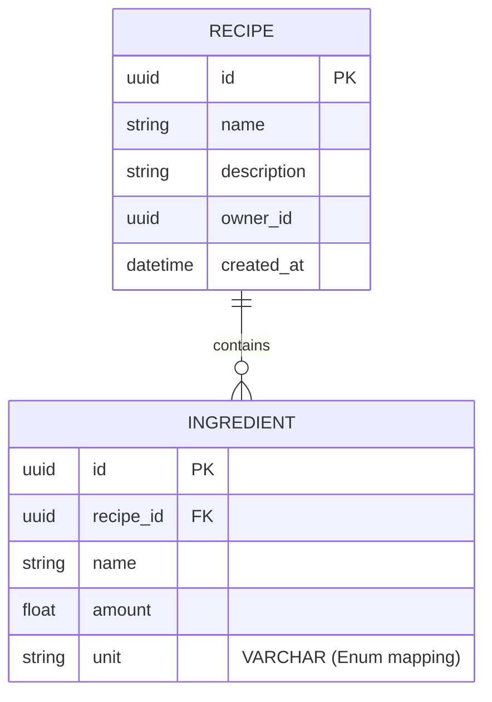

```text
  _____                           _ _     
 |_   _| __ ___ _ __   ___ __ _ __| (_)___ 
   | || '__/ _ \ '_ \ / __/ _` / _` | / __|
   | || | |  __/ | | | (_| (_| | (_| | \__ \
   |_||_|  \___|_| |_|\___\__,_|\__,_|_|___/
   
   Distributed Microservices Home Suite
   [ Python | Go | Java | Angular | K8s ]
```

# Trencadís: A Clean Architecture Microservices Suite

**Trencadís** is a home management ecosystem built to demonstrate modern software engineering practices. Inspired by the mosaic technique of **Catalan Modernism**, this project assembles diverse technologies (Python, Go, Java, Angular) into a cohesive, scalable, and robust distributed system.

## Architecture Overview
This project follows the **Clean Architecture** principles by Robert C. Martin. Each service is designed with a strict separation of concerns, ensuring the business logic remains independent of frameworks and external agencies.

- **Frontend:** Angular 17+ (Reactive State Management)
- **Recipe Service:** Python & FastAPI (High-performance API)
- **Shopping List Service:** Go (Concurrent & Lightweight)
- **Spending Service:** Java & Spring Boot (Enterprise-grade robustness)
- **Infrastructure:** Kubernetes (Orchestration) & GitHub Actions (CI/CD)

# Persistence Layer
The persistence layer is implemented using **SQLAlchemy 2.0** with an asynchronous approach via `asyncpg`.



## Database Schema
We follow a relational approach optimized for the Recipe Aggregate:
- **Recipes Table**: Stores the root entity. The `owner_id` field is indexed to optimize queries by user (Identity from Keycloak).
- **Ingredients Table**: Stores recipe components. It maintains a foreign key relationship with the Recipes table with `ON DELETE CASCADE`.

## Project Roadmap

### Phase 1: Core Infrastructure & Identity 
- [x] Monorepo structure and documentation.
- [x] **Identity Management:** Deploy **Keycloak** via Docker for OAuth2/OpenID Connect.
- [ ] Configure Realms, Clients, and Roles for the Trencadís ecosystem.

### Phase 2: Recipe Service (Python)
- [x] Implement Clean Architecture layers (Domain, Use Cases, Adapters).
- [x] **Security:** Integrate JWT validation middleware with Keycloak.
- [x] API documentation with Swagger/OpenAPI.
- [x] Test

### Phase 3: Shopping List Service (Go)
- [ ] High-concurrency service for real-time list management.
- [ ] Integration with Recipe Service via internal networking.
- [ ] Unit testing with Go's native testing tool.

### Phase 4: Financial Module (Java)
- [ ] Enterprise-grade spending tracker using Spring Boot.
- [ ] Persistence layer with Spring Data JPA.
- [ ] Advanced security patterns with Spring Security.

### Phase 5: Frontend Dashboard (Angular)
- [ ] Unified UI using Angular 17+ and Tailwind CSS.
- [ ] **OIDC Integration:** Secure login flow using Keycloak JS adapter.
- [ ] Reactive state management for real-time updates.

### Phase 6: Cloud Native & DevOps
- [ ] **Kubernetes:** Orchestrate all services using Helm charts.
- [ ] **CI/CD:** Automated pipelines with GitHub Actions.
- [ ] Monitoring and Logging (ELK or Prometheus/Grafana).

## Engineering Standards
- **Clean Code:** Self-documenting code, SRP, and meaningful naming.
- **SOLID Principles:** Strictly followed across all languages.
- **Testing:** Unit and Integration tests for every business use case.
- **Documentation:** Architecture decision records (ADR) and C4 Diagrams.

## Engineering Principles

This project serves as a practical implementation of high-level software engineering standards.

### Clean Architecture (by Robert C. Martin)
The architecture is structured in concentric layers, where dependencies only point inwards. This ensures that the **Business Logic (Domain)** is:
- **Independent of Frameworks:** The UI, Database, and external tools are treated as plugins.
- **Testable:** Logic can be tested without an external server or database.
- **Independent of UI:** The UI can change without changing the rest of the system.

### SOLID Principles
Every module in **Trencadís** is built with these principles in mind:
- **S**ingle Responsibility: Each class or function has one, and only one, reason to change.
- **O**pen/Closed: Software entities are open for extension but closed for modification.
- **L**iskov Substitution: Objects are replaceable with instances of their subtypes without altering correctness.
- **I**nterface Segregation: Clients should not be forced to depend on methods they do not use.
- **D**ependency Inversion: High-level modules do not depend on low-level modules; both depend on abstractions.

## Author
by AFelipeTrujillo
