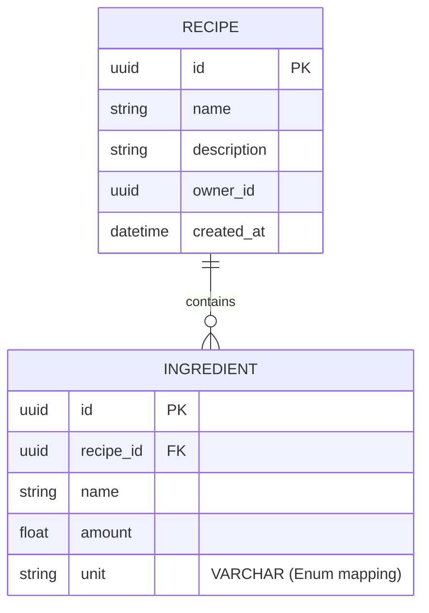

# Infrastructure & Identity Layer

This directory manages the orchestration and shared services for the **Trencadís** ecosystem. The core of our security architecture is based on **Keycloak**, providing a centralized Identity and Access Management (IAM) solution.

## Identity Provider (Keycloak)

We use **Keycloak 26.0.0 (Quarkus distribution)** to handle Authentication and Authorization (OAuth2/OpenID Connect).

### Key Features:
- **Realm:** `trencadis-home`
- **Security:** Managed via environment variables (`.env`).
- **Persistence:** PostgreSQL 16 database.
- **Client:** `trencadis-frontend` (Public OIDC for Angular).

### Automation & Realm Import

To ensure environment consistency and "Infrastructure as Code" principles, the Realm configuration is automatically imported during the first boot.

**How it works:**
The `docker-compose.yml` mounts the `./keycloak/realm-export.json` file into the Keycloak `/opt/keycloak/data/import/` directory. The container is configured with the following flag: `--import-realm`

### Deployment

```bash
cd infrastructure/docker
docker-compose up -d
```

**Note:** Ensure you have created your local .env file based on .env.example before running the command.

# Persistence Layer
The persistence layer is implemented using **SQLAlchemy 2.0** with an asynchronous approach via `asyncpg`.



## Database Schema
We follow a relational approach optimized for the Recipe Aggregate:
- **Recipes Table**: Stores the root entity. The `owner_id` field is indexed to optimize queries by user (Identity from Keycloak).
- **Ingredients Table**: Stores recipe components. It maintains a foreign key relationship with the Recipes table with `ON DELETE CASCADE`.